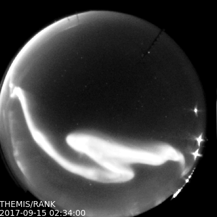

# aurora-asi-lib
Easily download, plot, animate, and analyze aurora all sky imager (ASI) data. Currently the two supported camera systems (missions) are: 
* Red-line Emission Geospace Observatory (REGO)
* Time History of Events and Macroscale Interactions during Substorms (THEMIS).




Feel free to contact me and request that I add other ASI missions to `asilib`.

## Examples
Before you can run these examples, make sure that `asilib` is configured with the installation steps below. These examples, and more, are in the `asilib/examples/` folder.

### Example 1
This example uses asilib to plot one frame of a bright auroral arc.
```python
from datetime import datetime

import matplotlib.pyplot as plt

import asilib

# A bright auroral arc that was analyzed by Imajo et al., 2021 "Active 
# auroral arc powered by accelerated electrons from very high altitudes"
frame_time, ax, im = asilib.plot_frame(datetime(2017, 9, 15, 2, 34, 0), 'THEMIS', 'RANK', 
                    color_norm='log', force_download=False)
plt.colorbar(im)
ax.axis('off')
plt.show()
```

### Example 2
This example uses asilib to plot a 5 minute movie of an auroral arc brightening right as a meteor burns up at zenith!

```python
from datetime import datetime

import asilib

time_range = (datetime(2015, 3, 26, 6, 7), datetime(2015, 3, 26, 6, 12))
asilib.plot_movie(time_range, 'THEMIS', 'FSMI')
print(f'Movie saved in {asilib.config.ASI_DATA_DIR / "movies"}')
```

### Example 3
This example is longer and it shows how to superpose a hypothetical satellite path through the THEMIS camera located at Rankin Inlet.

```python
from datetime import datetime

import numpy as np

from asilib import plot_movie_generator
from asilib import lla_to_skyfield
from asilib import load_cal_file


# ASI parameters
mission = 'THEMIS'
station = 'RANK'
time_range = (datetime(2017, 9, 15, 2, 34, 0), datetime(2017, 9, 15, 2, 36, 0))

# Load the calibration data.
cal_dict = load_cal_file(mission, station)

# Create the satellite track's latitude, longitude, altitude (LLA) coordinates.
# This is an imaginary north-south satellite track oriented to the east
# of the THEMIS/RANK station.
n = int((time_range[1] - time_range[0]).total_seconds() / 3)  # 3 second cadence.
lats = np.linspace(cal_dict["SITE_MAP_LATITUDE"] + 10, cal_dict["SITE_MAP_LATITUDE"] - 10, n)
lons = (cal_dict["SITE_MAP_LONGITUDE"] + 3) * np.ones(n)
alts = 500 * np.ones(n)
lla = np.array([lats, lons, alts]).T

# Map the satellite track to the station's azimuth and elevation coordinates as well as the
# image pixels
# The mapping is not along the magnetic field lines! You need to install IRBEM and then use
# asilib.map_along_magnetic_field().
sat_azel, sat_azel_pixels = lla_to_skyfield(mission, station, lla)

# Initiate the movie generator function.
movie_generator = plot_movie_generator(
    time_range, mission, station, azel_contours=True, overwrite=True
)

for i, (time, frame, ax, im) in enumerate(movie_generator):
    # Plot the entire satellite track
    ax.plot(sat_azel_pixels[:, 0], sat_azel_pixels[:, 1], 'red')
    # Plot the current satellite position.
    ax.scatter(sat_azel_pixels[i, 0], sat_azel_pixels[i, 1], c='red', marker='x', s=100)

    # Annotate the station and satellite info in the top-left corner.
    station_str = (
        f'{mission}/{station} '
        f'LLA=({cal_dict["SITE_MAP_LATITUDE"]:.2f}, '
        f'{cal_dict["SITE_MAP_LONGITUDE"]:.2f}, {cal_dict["SITE_MAP_ALTITUDE"]:.2f})'
    )
    satellite_str = f'Satellite LLA=({lla[i, 0]:.2f}, {lla[i, 1]:.2f}, {lla[i, 2]:.2f})'
    ax.text(0, 1, station_str + '\n' + satellite_str, va='top', 
            transform=ax.transAxes, color='red')
```

## Installation
To install this package as a user, run:

```shell
python3 -m pip install aurora-asi-lib
```

To install this package as a developer, run:

```shell
git clone git@github.com:mshumko/aurora-asi-lib.git
cd aurora-asi-lib
python3 -m pip install -r requirements.txt # or
python3 -m pip install -e .
```


In either case, you'll need to configure your system paths to tell `asilib` (the import name) where to save the ASI data and movies. Run ```python3 -m asilib config``` to set up the data directory where the image, calibration, and movie files will be saved. Your settings will be stored in `config.py`. If you configure `asilib`, but don't specify a data directory, a default directory in `~/asilib-data` will be created if it doesn't exist.

### ffmpeg dependency
To make  movies you'll also need to install the ffmpeg library.
 - **Ubuntu**: ```apt install ffmpeg```
 - **Mac**: ```brew install ffmpeg```

__NOTES__
- If you get the "ERROR: Could not build wheels for pymap3d which use PEP 517 and cannot be installed directly" error when installing, you need to upgrade your pip, setuptools, and wheel libaries via ```python3 -m pip install --upgrade pip setuptools wheel```.

## User Guide
**Note** These are top-level descriptions: The full parameter list and an example for each function is accessible via the built-in ```help()``` function. 

**Note 2** The longitude units are converted from 0->360 to -180->180 degrees in the calibration files.

### Download ASI Data
To download ASI data, the programs in the ```asilib/io/``` search for and download the THEMIS and REGO image and calibration data.

* `asilib.download_themis_img()` and `asilib.download_rego_img()`: downloads the THEMIS and REGO images in the common data format (CDF) files.
* `asilib.download_themis_cal()` and `asilib.download_rego_cal()`: downloads the THEMIS and REGO images in the common data format (CDF) files.

### Load ASI Data
There are a few data loading functions that automaticaly call the download programs if a file is not found on the local computer or the user explicitly passes ```force_download = True``` to force the download. These functions are in `config.py`.

* `asilib.load_img_file()`: Returns an `cdflib.CDF()` file object for an ASI
file specified by the date-time, mission, and station. See the [cdflib](https://github.com/MAVENSDC/cdflib) documentaion for the CDF interface.
* `asilib.load_cal_file()`: Returns an dictionary containing the latest calibration data from a specified mission/station. Be aware that the longitude is mapped from 0 to 360 to -180 to 180 degrees.
* `asilib.get_frame()`: Given a mission/station and a date-time, this function calls `asilib.load_img_file()` and returns the time stamp and one image (frame) with a time stamp within ```time_thresh_s = 3``` seconds (optional kwarg), otherwise an AssertionError is raised if a ASI time stamp is not found.
* `asilib.get_frames()`: Given a mission/station and a date-time ```time_range```, this function calls `asilib.load_img_file()` and returns an array of time stamps and images observed at times inside the ```time_range```.

### Plot ASI Data
There are two modules that plot a single frame or a series of frames.

* `asilib.plot_frame()`: Given a mission/station and a date-time arguments, this function calls `asilib.get_frame()` and plots one ASI frame. By default, the color map is black-white for THEMIS and black-red for REGO, the color scale is logarthmic, and color map limits are automatically set as ```(25th percentile, min(98th percentile, 10x25th percentile))```. This ensures a good dynamic range for each frame. The subplot object, the frame time, and the ```plt.imshow()``` objects are returned so the user can add to the subplot.

* `asilib.plot_movie()`: Similar to `asilib.plot_frame()`, given a mission/station and a ```time_range``` arguments, this function calls `asilib.get_frames()` and plots one multiple ASI frames and saves them to ```/data/movies/```. Movie file creation, such as an `mp4` or `gif`, is not implemented yet because I have not found a movie writer that is available between Windows/Linux/Mac.

* `plot_movie_generator()`: The generator function that allows the user to overlay other plots on the movie.

* `plot_collage()`: Similar to `asilib.plot_movie()` in that the arguments are the same, but this function returns a collage of images with the time stamps annotated.

### Mapping satellite position to the skyfield
* `asilib.map_skyfield()`: maps the satellite coordinates from LLA (latitude, longitude, altitudes) to the ASI image x and y pixel indices. This function relies on the azimuth and elevation calibration files that can be downloaded via `asilib.load_cal_file()`. This function does **not** map the satellite position along the magnetic field line, that is done by `map_along_magnetic_field.py` and requires IRBEM-Lib to be installed (beyond the scope of this user guide).
* `map_along_magnetic_field.py`: magnetically maps the satellite LLA coordinates with time stamps to a specified altitude. The hemisphere of the mapping can be: same, opposite, northern, or southern. 
