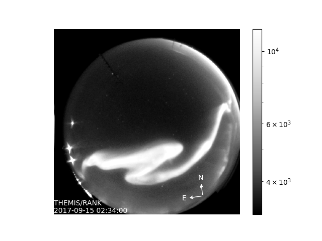
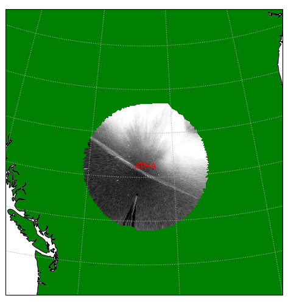
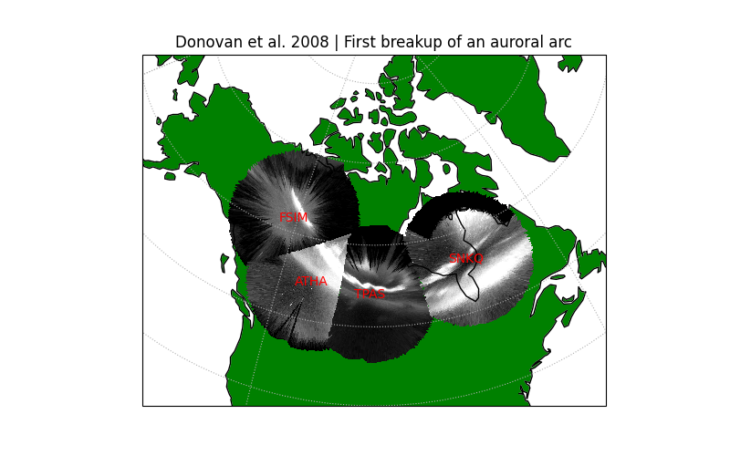
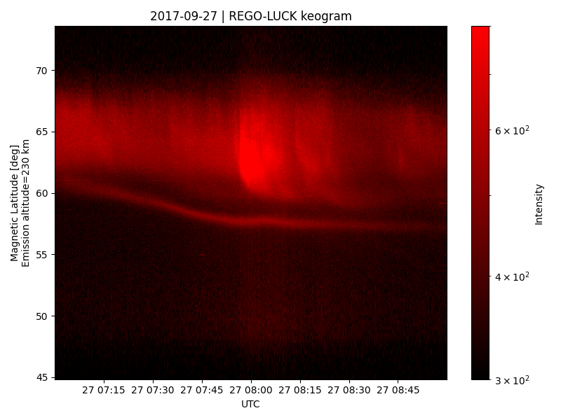
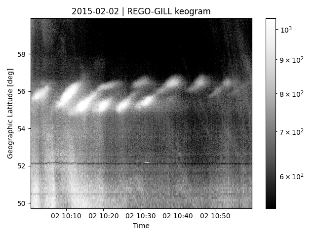

.. _Examples:

========
Examples
========

This example gallery using the best practices and illustrates functionality throughout `asilib`. These are complete examples that are also included in the ``asilib/examples/`` directory on GitHub. 

Fisheye Lens View of an Arc
^^^^^^^^^^^^^^^^^^^^^^^^^^^
A bright auroral arc that was analyzed by Imajo et al. 2021 "Active auroral arc powered by accelerated electrons from very high altitudes"

.. code:: python

    from datetime import datetime

    import matplotlib.pyplot as plt

    import asilib.asi

    location_code = 'RANK'
    time = datetime(2017, 9, 15, 2, 34, 0)

    asi = asilib.asi.themis(location_code, time=time)
    ax, im = asi.plot_fisheye()
    plt.colorbar(im)
    ax.axis('off')
    plt.show()

STEVE projected onto a map
^^^^^^^^^^^^^^^^^^^^^^^^^^
Maps an image of STEVE (the thin band). Reproduced from http://themis.igpp.ucla.edu/nuggets/nuggets_2018/Gallardo-Lacourt/fig2.jpg

.. code:: python

    from datetime import datetime

    import matplotlib.pyplot as plt

    import asilib.asi
    import asilib.map

    ax = asilib.map.create_map(lon_bounds=(-127, -100), lat_bounds=(45, 65))

    asi = asilib.asi.themis('ATHA', time=datetime(2010, 4, 5, 6, 7, 0), alt=110)
    asi.plot_map(ax=ax)
    plt.tight_layout()
    plt.show()

Auroral arc projected onto a map
^^^^^^^^^^^^^^^^^^^^^^^^^^^^^^^^
The first breakup of an auroral arc during a substorm analyzed by Donovan et al. 2008 "Simultaneous THEMIS in situ and auroral observations of a small substorm"

.. code:: python

    from datetime import datetime

    import matplotlib.pyplot as plt

    import asilib
    import asilib.map
    import asilib.asi

    time = datetime(2007, 3, 13, 5, 8, 45)
    location_codes = ['FSIM', 'ATHA', 'TPAS', 'SNKQ']
    map_alt = 110
    min_elevation = 2

    ax = asilib.map.create_simple_map(lon_bounds=(-140, -60), lat_bounds=(40, 82))

    _imagers = []

    for location_code in location_codes:
        _imagers.append(asilib.asi.themis(location_code, time=time, alt=map_alt))

    asis = asilib.Imagers(_imagers)
    asis.plot_map(ax=ax, overlap=False, min_elevation=min_elevation)

    ax.set_title('Donovan et al. 2008 | First breakup of an auroral arc')
    plt.show()

A keogram of STEVE
^^^^^^^^^^^^^^^^^^

A keogram with a STEVE event that moved towards the equator. This event was analyzed in Gallardo-Lacourt et al. 2018 "A statistical analysis of STEVE"

.. code:: python

    import matplotlib.pyplot as plt

    import asilib.asi

    location_code = 'LUCK'
    time_range = ['2017-09-27T07', '2017-09-27T09']
    map_alt_km = 230

    fig, ax = plt.subplots(figsize=(8, 6))
    asi = asilib.asi.rego(location_code, time_range=time_range, alt=map_alt_km)
    ax, p = asi.plot_keogram(ax=ax, color_bounds=(300, 800), aacgm=True)
    plt.colorbar(p, label='Intensity')
    ax.set_xlabel('UTC')
    ax.set_ylabel(f'Magnetic Latitude [deg]\nEmission altitude={map_alt_km} km')
    plt.tight_layout()
    plt.show()

Keogram of a field line resonance
^^^^^^^^^^^^^^^^^^^^^^^^^^^^^^^^^

A field line resonance studied in: Gillies, D. M., Knudsen, D., Rankin, R., Milan, S., & Donovan, E. (2018). A statistical survey of the 630.0-nm optical signature of periodic auroral arcs resulting from magnetospheric field line resonances. Geophysical Research Letters, 45(10), 4648-4655.

.. code:: python

    import matplotlib.pyplot as plt

    import asilib.asi

    location_code = 'GILL'
    time_range = ['2015-02-02T10', '2015-02-02T11']

    asi = asilib.asi.rego(location_code, time_range=time_range, alt=230)
    ax, p = asi.plot_keogram(color_map='Greys_r')
    plt.xlabel('Time')
    plt.ylabel('Geographic Latitude [deg]')
    plt.colorbar(p)
    plt.tight_layout()
    plt.show()

Fisheye Movie
^^^^^^^^^^^^^

.. raw:: html

    <iframe width="75%" height="500"
    src="_static/example_outputs/20150326_060700_063000_themis_fsmi_fisheye.mp4"; frameborder="0"
    allowfullscreen></iframe>

.. code:: python

    from datetime import datetime

    import asilib.asi

    location_code = 'FSMI'
    time_range = (datetime(2015, 3, 26, 6, 7), datetime(2015, 3, 26, 6, 30))
    asi = asilib.asi.themis(location_code, time_range=time_range)
    asi.animate_fisheye()

    print(f'Animation saved in {asilib.config["ASI_DATA_DIR"] / "animations" / asi.animation_name}')

Map movie
^^^^^^^^^

.. raw:: html

    <iframe width="75%" height="400"
    src="_static/example_outputs/20150326_060700_061200_themis_fsmi_map.mp4"; frameborder="0"
    allowfullscreen></iframe>

.. code:: python

    from datetime import datetime

    import asilib.asi
    import asilib.map

    time_range = (datetime(2015, 3, 26, 6, 7), datetime(2015, 3, 26, 6, 12))
    location_code = 'FSMI'

    asi = asilib.asi.themis(location_code, time_range=time_range, alt=110)

    lat_bounds = (asi.meta['lat'] - 7, asi.meta['lat'] + 7)
    lon_bounds = (asi.meta['lon'] - 20, asi.meta['lon'] + 20)
    ax = asilib.map.create_map(lon_bounds=lon_bounds, lat_bounds=lat_bounds)

    asi.animate_map(ax=ax)

    print(f'Animation saved in {asilib.config["ASI_DATA_DIR"] / "animations" / asi.animation_name}')

Animate Mosaic
^^^^^^^^^^^^^^

.. raw:: html

    <iframe width="75%" height="400"
    src="_static/example_outputs/20211104_065500_070500_mosaic.mp4"; frameborder="0"
    allowfullscreen></iframe>

.. code:: python

    import asilib
    import asilib.asi
    
    time_range = ('2021-11-04T06:55', '2021-11-04T07:05')
    asis = asilib.Imagers(
        [asilib.asi.trex_rgb(location_code, time_range=time_range)
        for location_code in ['LUCK', 'PINA', 'GILL', 'RABB']]
        )
    asis.animate_map(lon_bounds=(-115, -85), lat_bounds=(43, 63), overwrite=True)

ASI-satellite conjunction movie
^^^^^^^^^^^^^^^^^^^^^^^^^^^^^^^
    
A comprehensive example that maps a hypothetical satellite track to an image and calculates the mean ASI intensity in a 20x20 km box around the satellite's 100 km altitude footprint.

.. raw:: html

    <iframe width="75%", height="850px"
    src="_static/example_outputs/20170915_023200_023500_themis_rank_fisheye.mp4"
    allowfullscreen></iframe>

.. code:: python

    from datetime import datetime

    import numpy as np
    import matplotlib.pyplot as plt

    import asilib
    import asilib.asi

    # ASI parameters
    location_code = 'RANK'
    alt=110  # km
    time_range = (datetime(2017, 9, 15, 2, 32, 0), datetime(2017, 9, 15, 2, 35, 0))

    fig, ax = plt.subplots(
        3, 1, figsize=(7, 10), gridspec_kw={'height_ratios': [4, 1, 1]}, constrained_layout=True
    )

    asi = asilib.asi.themis(location_code, time_range=time_range, alt=alt)

    # Create the fake satellite track coordinates: latitude, longitude, altitude (LLA).
    # This is a north-south satellite track oriented to the east of the THEMIS/RANK
    # imager.
    n = int((time_range[1] - time_range[0]).total_seconds() / 3)  # 3 second cadence.
    lats = np.linspace(asi.meta["lat"] + 5, asi.meta["lat"] - 5, n)
    lons = (asi.meta["lon"] - 0.5) * np.ones(n)
    alts = alt * np.ones(n)  # Altitude needs to be the same as the skymap.
    sat_lla = np.array([lats, lons, alts]).T
    # Normally the satellite time stamps are not the same as the ASI. 
    # You may need to call Conjunction.interp_sat() to find the LLA coordinates
    # at the ASI timestamps.
    sat_time = asi.data.time

    conjunction_obj = asilib.Conjunction(asi, (sat_time, sat_lla))

    # Map the satellite track to the imager's azimuth and elevation coordinates and
    # image pixels. NOTE: the mapping is not along the magnetic field lines! You need
    # to install IRBEM and then use conjunction.lla_footprint() before
    # calling conjunction_obj.map_azel.
    sat_azel, sat_azel_pixels = conjunction_obj.map_azel()

    # Calculate the auroral intensity near the satellite and mean intensity within a 10x10 km area.
    nearest_pixel_intensity = conjunction_obj.intensity(box=None)
    area_intensity = conjunction_obj.intensity(box=(10, 10))
    area_mask = conjunction_obj.equal_area(box=(10,10))

    # Need to change masked NaNs to 0s so we can plot the rectangular area contours.
    area_mask[np.where(np.isnan(area_mask))] = 0

    # Initiate the animation generator function.
    gen = asi.animate_fisheye_gen(
        ax=ax[0], azel_contours=True, overwrite=True, cardinal_directions='NE'
    )

    for i, (time, image, _, im) in enumerate(gen):
        # Plot the entire satellite track, its current location, and a 20x20 km box
        # around its location.
        ax[0].plot(sat_azel_pixels[:, 0], sat_azel_pixels[:, 1], 'red')
        ax[0].scatter(sat_azel_pixels[i, 0], sat_azel_pixels[i, 1], c='red', marker='o', s=50)
        ax[0].contour(area_mask[i, :, :], levels=[0.99], colors=['yellow'])

        if 'vline1' in locals():
            vline1.remove()  # noqa: F821
            vline2.remove()  # noqa: F821
            text_obj.remove()  # noqa: F821
        else:
            # Plot the ASI intensity along the satellite path
            ax[1].plot(sat_time, nearest_pixel_intensity)
            ax[2].plot(sat_time, area_intensity)
        vline1 = ax[1].axvline(time, c='b')
        vline2 = ax[2].axvline(time, c='b')

        # Annotate the location_code and satellite info in the top-left corner.
        location_code_str = (
            f'THEMIS/{location_code} '
            f'LLA=({asi.meta["lat"]:.2f}, '
            f'{asi.meta["lon"]:.2f}, {asi.meta["alt"]:.2f})'
        )
        satellite_str = f'Satellite LLA=({sat_lla[i, 0]:.2f}, {sat_lla[i, 1]:.2f}, {sat_lla[i, 2]:.2f})'
        text_obj = ax[0].text(
            0,
            1,
            location_code_str + '\n' + satellite_str,
            va='top',
            transform=ax[0].transAxes,
            color='red',
        )
        ax[1].set(ylabel='ASI intensity\nnearest pixel [counts]')
        ax[2].set(xlabel='Time', ylabel='ASI intensity\n10x10 km area [counts]')

    print(f'Animation saved in {asilib.config["ASI_DATA_DIR"] / "animations" / asi.animation_name}')