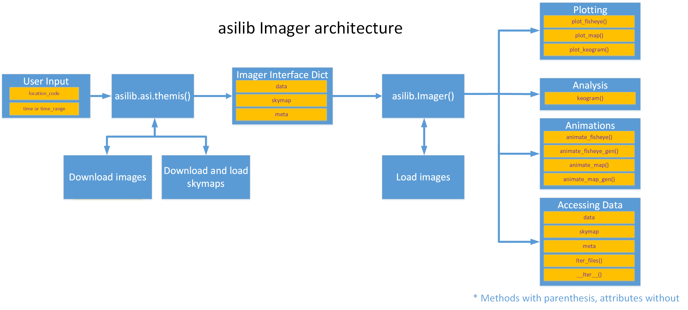

===========
Get Started
=========== 

Install
-------

Installing asilib is as simple as:

.. code-block:: shell

   python3 -m pip install asilib 


Anaconda
^^^^^^^^

`asilib` can also be installed with pip inside Anaconda. In a new environment install scipy first and then install asilib using the above instructions. 


.. note::
   - By default, asilib saves the ASI data, movie images, and movies in the `~/asilib-data/` directory. To override the default directory, run asilib as a module, `python3 -m asilib config`. See the Configuration section below for more details.

   - If you get the "`ERROR: Could not build wheels for pymap3d which use PEP 517 and cannot be installed directly`" error when installing, you need to upgrade your pip, setuptools, and wheel libaries via ```python3 -m pip install --upgrade pip setuptools wheel```.

Dependencies
^^^^^^^^^^^^
There are three optional dependencies that you may want to install if you want to use certain `asilib` functions.

+----------------+------------------------------+--------------------------------------+
| **Dependency** | **Purpose**                  | **asilib methods**                   |
+----------------+---------+--------------------+--------------------------------------+
| ffmpeg         | Animating Images             | | asilib.Imager.animate_fisheye()    |
|                |                              | | asilib.Imager.animate_map()        |
|                |                              | | asilib.Imager.animate_fisheye_gen()|
|                |                              | | asilib.Imager.animate_map_gen()    |
+----------------+------------------------------+--------------------------------------+
| IRBEM          | Magnetic field footprint     | asilib.Conjunction.lla_footprint()   |
+----------------+------------------------------+--------------------------------------+
| cartopy        | Projecting images onto a map | asilib.map.create_map()*             |
+----------------+------------------------------+--------------------------------------+

*\*create_map() will fallback to a simple map function if cartopy is not installed.*

Configuration
^^^^^^^^^^^^^
asilib writes the data and movie files to the `asilib.config['ASI_DATA_DIR']` directory. By default `ASI_DATA_DIR` is pointed at `~/asilib-data` and it is configurable. To configure `ASI_DATA_DIR`, and other asilib settings, run `python3 -m asilib config` and answer the prompts. The prompt answer in [brackets] is the default if you don't enter anything.

Core Concepts
-------------
The core of the user interface is the :py:meth:`~asilib.imager.Imager` class. It is invoked using an *entry function* such as :py:meth:`asilib.asi.themis`, :py:meth:`asilib.asi.rego`, or :py:meth:`asilib.asi.trex.trex_nir`.

The entry function downloads the necessary image and skymap files, and passes the skymap arrays and image file paths to :py:meth:`~asilib.imager.Imager`. The entry function also specifies a loader function that loads one file given it's path. :py:meth:`~asilib.imager.Imager` uses these paths to load data as needed---also referred to as the "lazy mode"---to maintain a low money usage (necessary if working with high speed ASIs or simultaneously with multiple ASIs). If memory is not an issue, you can load all of the ASI data at once---also referred to as the "greedy mode".

Once initiated, :py:meth:`~asilib.imager.Imager` exposes an intuitive user API to load, plot, animate, and analyze ASI data.

.. note::

   Considering that some ASIs produce enough data to overwhelm your computer's memory, for example the Phantom ASIs in support of the LAMP sounding rocket produced 190 GB/hour of data, by default asilib loads data as needed. This is the "lazy" mode that prioritizes memory at the expense of longer run time. Alternatively, if memory is not a concern, asilib supports an "eager" mode that loads all of the data into memory. Eager mode is triggered by calling the `Imager().data` attribute. 

The architecture described so far is illustrated in the flowchart below.



asilib also implements two classes to extend :py:meth:`~asilib.imager.Imager`. First, :py:meth:`~asilib.conjunction.Conjunction` finds and calculates auroral intensity near a satellite's footprint. Second, :py:meth:`~asilib.imagers.Imagers` plots and animates images from multiple :py:meth:`~asilib.imager.Imager` instances.

:py:meth:`~asilib.conjunction.Conjunction`: Often ASI observations need to be combined with in-situ measurements such as low Earth orbiting satellites. This involves mapping the ASI pixels and the satellite location to an assumed emission altitude (e.g., 110 km). This mapping is done via line-of-sight for the ASI pixels, and along magnetic field lines for the satellite (to the satellite's footprint).

:py:meth:`~asilib.imagers.Imagers` plots and animates images from multiple :py:meth:`~asilib.imager.Imager` instances. This is useful for creating mosaics (multiple images mapped onto a map). While you can call :py:meth:`~asilib.imager.Imager.plot_map()` for each Imager, any overlapping fields of view will be overplotted except the final imager (see the `zorder <https://matplotlib.org/stable/gallery/misc/zorder_demo.html>`_ concept). :py:meth:`~asilib.imagers.Imagers.plot_map()` overcomes this issue for overlapping fields of view by plotting only the higher elevation pixels (the ones that have the least amount of spatial distortion.) Another reason to use :py:meth:`~asilib.imagers.Imagers` is to synchronize animating multiple :py:meth:`~asilib.imager.Imager` fisheye or mapped images.

Examples
--------
See the :ref:`Examples` gallery for fully-functioning examples of the fundamental asilib functionality.

Tutorial
--------
See the :ref:`Tutorials` for comprehensive walk-throughs of the asilib functionality.