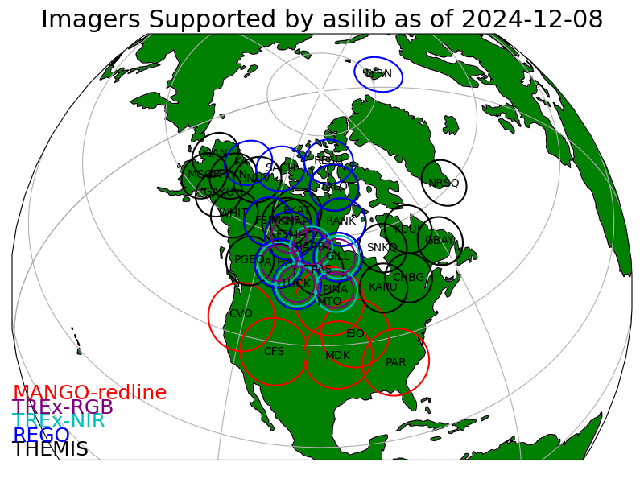

.. image:: ./_static/aurora-asi-lib_logo.png
  :alt: Alternative text

**Last Built**: |today| | **Version**: |version| | **Source**: `github`_ | **Archive**: `zenodo`_.

.. _github: https://github.com/mshumko/aurora-asi-lib
.. _zenodo: https://doi.org/10.5281/zenodo.4746446

Your one stop to working with the world's extensive arrays of auroral all-sky imagers (ASI).

Supported ASI arrays
--------------------   
- :ref:`rego_asi`,
- :ref:`themis_asi`,
- :ref:`trex_asi`

.. note::
   While this package is named `aurora-asi-lib`, import it using the name `asilib`.

.. figure:: ./_static/collage.png
   :alt: Top four panels are a collage showing an image from a THEMIS and REGO ASI in the fisheye and mapped formats. The bottom panel is a THEMIS ASI keogram from this time interval. 
   :width: 75%

Acknowledgements
----------------
If asilib significantly contributed to your research, and you would like to acknowledge it in your academic publication, we suggest citing the following paper:

- Shumko M, Chaddock D, Gallardo-Lacourt B, Donovan E, Spanswick EL, Halford AJ, Thompson I and Murphy KR (2022), AuroraX, PyAuroraX, and aurora-asi-lib: A user-friendly auroral all-sky imager analysis framework. Front. Astron. Space Sci. 9:1009450. doi: 10.3389/fspas.2022.1009450

.. toctree::
   :maxdepth: 2
   :caption: asilib:

   get_started
   examples
   tutorials
   imager_api
   function_api
   contribute