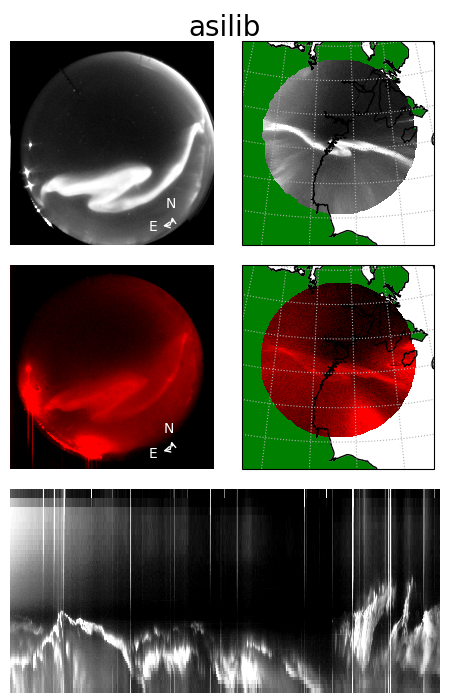

**Last Built**: |today| | **Version**: |version| | **Source**: `github`_ | **Archive**: `zenodo`_.

.. _github: https://github.com/mshumko/asilib
.. _zenodo: https://doi.org/10.5281/zenodo.4746446
.. _pypi: https://pypi.org/project/asilib/

asilib is an open source package providing data access and analysis tools for the world's all-sky imager (ASI) data.

.. note::
  The asilib code on PyPI moved from `aurora-asi-lib <https://pypi.org/project/aurora-asi-lib/>`_ to `asilib <https://pypi.org/project/asilib/>`_. To update to version >=0.22.0, run

  #. `python3 -m pip uninstall aurora-asi-lib` and
  #. `python3 -m pip install asilib`.

The purpose of this project is to combine data from numerous observational ASI arrays into a single unified framework and is thus not associated with the development and operations of all sky cameras, or the curation of ASI datasets. All data is publicly available and is provided as-is. Please give appropriate credit and coordinate with instrument teams with regards to data issues and/or interpretation. See the :ref:`acknowledgements` section for more information.

Supported ASI arrays
--------------------   
- :ref:`rego_asi`,
- :ref:`themis_asi`,
- :ref:`trex_asi`,
- :ref:`mango_asi`

.. figure:: ./_static/global_coverage.png
   :alt: A geographic map showing the spatial coverage (field of view rings) of all imagers supported by asilib.
   :width: 75%

.. _acknowledgements:

Acknowledgements
----------------

asilib is not associated with the development and operations of all sky cameras, or the curation of ASI datasets. All data accessed by asilib is publicly available from the home institution responsible for the instrumentation. We recommend data users coordinate with instrument teams with regards to data issues and/or interpretation. Users are responsible to appropriately acknowledge the data sources they utilize. Required acknowledgements are contained in the descriptions of each instrument network.

If asilib significantly contributed to your research, and you would like to acknowledge it in your academic publication, please consider including the asilib developers as co-authors, and/or citing the following paper on asilib:

- Shumko M, Chaddock D, Gallardo-Lacourt B, Donovan E, Spanswick EL, Halford AJ, Thompson I and Murphy KR (2022), AuroraX, PyAuroraX, and aurora-asi-lib: A user-friendly auroral all-sky imager analysis framework. Front. Astron. Space Sci. 9:1009450. doi: 10.3389/fspas.2022.1009450

Lastly, asilib will not be possible without 1) everyone involved with designing, building, and maintaining all-sky imaging systems, and 2) everyone who contributed to the dependencies used by `asilib`. Some of the dependencies include:

- numpy: Harris, C.R., Millman, K.J., van der Walt, S.J. et al. Array programming with NumPy. Nature 585, 357-362 (2020). DOI: 10.1038/s41586-020-2649-2. ([Publisher link](https://www.nature.com/articles/s41586-020-2649-2)).

- Scipy: Pauli Virtanen, Ralf Gommers, Travis E. Oliphant, Matt Haberland, Tyler Reddy, David Cournapeau, Evgeni Burovski, Pearu Peterson, Warren Weckesser, Jonathan Bright, Stéfan J. van der Walt, Matthew Brett, Joshua Wilson, K. Jarrod Millman, Nikolay Mayorov, Andrew R. J. Nelson, Eric Jones, Robert Kern, Eric Larson, CJ Carey, İlhan Polat, Yu Feng, Eric W. Moore, Jake VanderPlas, Denis Laxalde, Josef Perktold, Robert Cimrman, Ian Henriksen, E.A. Quintero, Charles R Harris, Anne M. Archibald, Antônio H. Ribeiro, Fabian Pedregosa, Paul van Mulbregt, and SciPy 1.0 Contributors. (2020) SciPy 1.0: Fundamental Algorithms for Scientific Computing in Python. Nature Methods, 17(3), 261-272.

- aacgm2: Angeline Burrell for the Python source and Shepherd, S. G. (2014), Altitude-adjusted corrected geomagnetic coordinates: Definition and functional approximations, Journal of Geophysical Research: Space Physics, 119, 7501-7521, doi:10.1002/2014JA020264. 

- pandas: Jeff Reback, Wes McKinney, jbrockmendel, Joris Van den Bossche, Tom Augspurger, Phillip Cloud, gfyoung, Sinhrks, Adam Klein, Matthew Roeschke, Simon Hawkins, Jeff Tratner, Chang She, William Ayd, Terji Petersen, Marc Garcia, Jeremy Schendel, Andy Hayden, MomIsBestFriend, … Mortada Mehyar. (2020). pandas-dev/pandas: Pandas 1.0.3 (v1.0.3). Zenodo. https://doi.org/10.5281/zenodo.3715232

- cartopy: Phil Elson, Elliott Sales de Andrade, Greg Lucas, Ryan May, Richard Hattersley, Ed Campbell, Andrew Dawson, Stephane Raynaud, scmc72, Bill Little, Alan D. Snow, Kevin Donkers, Byron Blay, Peter Killick, Nat Wilson, Patrick Peglar, lbdreyer, Andrew, Jon Szymaniak, … Mark Hedley. (2022). SciTools/cartopy: v0.20.2 (v0.20.2). Zenodo. https://doi.org/10.5281/zenodo.5842769

- IRBEM: Boscher, D., Bourdarie, S., O'Brien, P., Guild, T., & Shumko, M. (2012). IRBEM-lib library. https://zenodo.org/doi/10.5281/zenodo.6867552

- themis-imager-readfile: https://github.com/ucalgary-aurora/themis-imager-readfile

- rego-imager-readfile: https://github.com/ucalgary-aurora/rego-imager-readfile

- trex-imager-readfile: https://github.com/ucalgary-aurora/trex-imager-readfile

.. toctree::
   :maxdepth: 2
   :caption: Table of Contents:

   get_started
   examples
   tutorials
   api
   contribute
